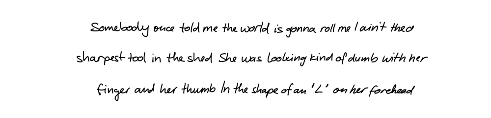
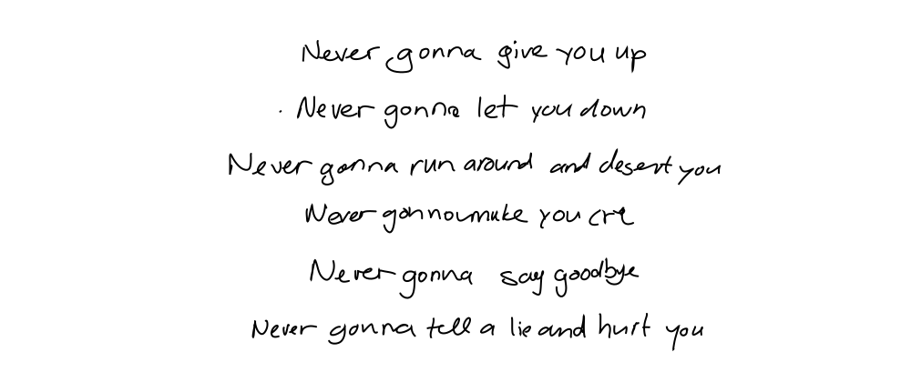

# Handwriting Synthesis

Synthesize realistic handwritten text from ASCII input using a recurrent neural network. The model generates pen stroke sequences rendered as SVG files, with controllable style and legibility.

[](https://colab.research.google.com/drive/1QEAgA-6sCg6fCZiA1NYW46eWP6-VB1hq?usp=sharing)

---

## Demo







---

## How It Works

The model is based on Alex Graves' [Generating Sequences With Recurrent Neural Networks](https://arxiv.org/abs/1308.0850). It uses a 3-layer LSTM network with a soft attention mechanism that aligns pen strokes to input characters.

**Architecture:**
- 3 stacked LSTM layers, each with 400 units
- A window-based soft attention mechanism with 10 mixture components that scans the character sequence as strokes are generated
- A Gaussian Mixture Model (GMM) output head with 20 components that models the (x, y) pen position at each timestep
- A Bernoulli output that predicts pen-up events (end of stroke)

At inference time, the model either generates from scratch or is primed with a reference stroke sequence to mimic a given handwriting style. The `bias` parameter scales the mixture weights and sharpens the GMM, trading randomness for legibility.

---

## Installation

```bash
pip install -r requirements.txt
```

**Dependencies:**
- `tensorflow==2.12.0` (runs in TF1 compatibility mode)
- `tensorflow-probability==0.20.1`
- `numpy`, `scipy`, `scikit-learn`, `pandas`, `matplotlib`
- `svgwrite>=1.1.12`
- `cairosvg`, `pillow` (for the GUI)

---

## Quickstart

A pretrained model checkpoint is included at `model/checkpoint/` (step 17900). No training required to start generating.

```python
from handwriting_synthesis import Hand

hand = Hand()

lines = [
    "Father time, I'm running late",
    "I'm winding down, I'm growing tired",
    "Seconds drift into the night",
    "The clock just ticks till my time expires",
]

hand.write(
    filename='output.svg',
    lines=lines,
    biases=[0.75, 0.75, 0.75, 0.75],
    styles=[9, 9, 9, 9],
    stroke_colors=['black', 'black', 'black', 'black'],
    stroke_widths=[1, 1, 1, 1],
)
```

Each line is written independently and stacked vertically in the output SVG.

---

## `Hand.write` Parameters

| Parameter | Type | Description |
|---|---|---|
| `filename` | `str` | Output SVG path |
| `lines` | `list[str]` | Lines of text to render. Max **75 characters per line**. Only printable ASCII is supported. |
| `biases` | `list[float]` | Per-line legibility bias. Higher values (e.g. `0.75`) produce neater handwriting; lower values (e.g. `0.1`) produce more chaotic, natural-looking strokes. One value per line. |
| `styles` | `list[int]` | Per-line handwriting style index (`0`–`12`). Each style is a reference stroke sequence stored in `model/style/`. When set, the model is primed on that style before generating. |
| `stroke_colors` | `list[str]` | Per-line SVG stroke color (e.g. `'black'`, `'red'`, `'#333'`). Defaults to black. |
| `stroke_widths` | `list[int\|float]` | Per-line stroke width in SVG units. Defaults to `1`. |

`styles` and `biases` must each have one value per line. `stroke_colors` and `stroke_widths` are optional.

---

## GUI

A desktop GUI is included for interactive generation:

```bash
python GUI.py
```

Type text into the input field and click **Submit**. The synthesized handwriting is rendered and displayed inline. Requires `tkinter`, `cairosvg`, and `pillow`.

---

## PDF Export

`pdf.py` converts a generated SVG to PDF using `svglib` and `reportlab`:

```bash
python pdf.py
```

Edit the script to point at any SVG you have generated.

---

## Style Reference

Styles `0`–`12` are pre-extracted from the IAM dataset and stored as `.npy` files in `model/style/`. Each style file pair consists of:
- `style-N-strokes.npy` — the reference stroke sequence used to prime the LSTM state
- `style-N-chars.npy` — the corresponding character labels for the attention mechanism

You can add your own styles by extracting stroke and character arrays in the same format and placing them in `model/style/`.

---

## Training From Scratch

Training requires the [IAM On-Line Handwriting Database](http://www.fki.inf.unibe.ch/databases/iam-on-line-handwriting-database).

**1. Download the following files:**
- `ascii-all.tar.gz`
- `lineStrokes-all.tar.gz`
- `original-xml-part.tar.gz`

**2. Arrange the data directory:**

```
model/data/
└── raw/
    ├── ascii/
    ├── lineStrokes/
    └── original/
```

**3. Prepare the data:**

```python
from handwriting_synthesis.training.preparation import prepare
prepare()
```

This extracts stroke sequences and encodes character labels, writing processed `.npy` files to `model/data/processed/`.

**4. Train:**

```python
from handwriting_synthesis.training import train
train()
```

Training uses a 3-phase learning rate schedule (`1e-4` → `5e-5` → `2e-5`) with RMSProp. It takes approximately 2 days on a Tesla K80. Checkpoints are saved to `model/checkpoint/` every 2000 steps.

---

## Constraints

- Lines must be ≤ 75 characters.
- Only characters in the supported ASCII alphabet are valid. Passing unsupported characters raises a `ValueError`.
- The model runs in TensorFlow 1 compatibility mode (`tf.compat.v1`) due to its use of `dynamic_rnn` and TF1-style placeholders.
